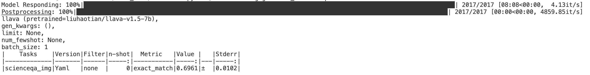

# Visual Tokens Withdrawal 
Code release for "Boosting Multimodal Large Language Models with Visual Tokens
Withdrawal for Rapid Inference" 


## Experiments Environment
### Set Up the Dependencies as:
```
# install llava
conda create -n vtw python=3.10 -y
conda activate vtw
pip install --upgrade pip  # enable PEP 660 support
pip install -e .
# install lmms-eval
cd lmms-evaluation
pip install -e .
```

## Chatbot
```
python -m llava.serve.cli \
    --model-path liuhaotian/llava-v1.5-7b   \
    --image-file "https://llava-vl.github.io/static/images/view.jpg" \
    --use_vtw
``` 

## Search Visual Tokens Withdrawal  Layer K
```bash
accelerate launch  --num_processes=1 --main_process_port=12346 -m lmms_eval --model llava \
    --model_args pretrained="liuhaotian/llava-v1.5-7b"  \
    --tasks scienceqa_img --batch_size 1 \
    --log_samples_suffix llava-1.5-7b \
    --output_path ./logs/ \
    --limit 20 --findk
```


## Evaluation Baseline
### Command
```bash
accelerate launch  --num_processes=1 --main_process_port=12346 -m lmms_eval --model llava \
    --model_args pretrained="liuhaotian/llava-v1.5-7b"  \
    --tasks scienceqa_img --batch_size 1 \
    --log_samples_suffix llava_7b \
    --output_path ./logs/7b/ 
```
### You will get


## Evaluation with Visual Tokens Withdrawal
### Command
```bash
accelerate launch  --num_processes=1 --main_process_port=12346 -m lmms_eval --model llava \
    --model_args pretrained="liuhaotian/llava-v1.5-7b"  \
    --tasks scienceqa_img --batch_size 1 \
    --log_samples_suffix llava_7b \
    --output_path ./logs/7b/ \
    --use_vtw --k=15    # Use the searched K or specify K manually 
```
### You will get


## Video-LLaVa
### Set Up the Dependencies as:
```
# install VideoLLaVA
cd VideoLLaVA/
pip install -e .
# install VLMEvalKit
cd VLMEvalKit-evaluation/
pip install -e .
```
### Video-MME
```bash
cd VLMEvalKit-evaluation/
torchrun --nproc-per-node=1 --master-port 12311 run.py --data  Video-MME --work-dir ./results/videollava_VTW --model Video-LLaVA-7B 
```
### TGIF
1. Inference to get the result.
```Shell
cd VideoLLaVA/
bash scripts/v1_5/eval/run_qa_tgif.sh
```

2. GPT-Assistant evaluation.
```Shell
bash scripts/v1_5/eval/eval_qa_tgif.sh
```

## Downstream Task
### [LISA](/LISA/readme.md)


