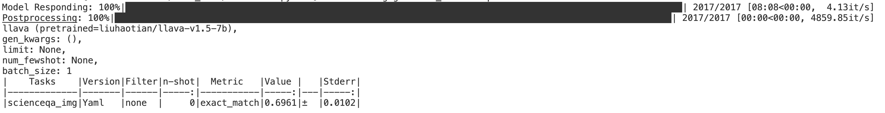
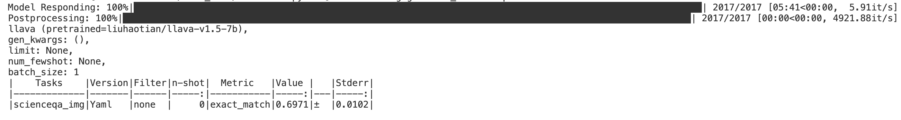

# Visual Tokens Withdrawal 
Code release for "[Boosting Multimodal Large Language Models with Visual Tokens
Withdrawal for Rapid Inference](https://arxiv.org/abs/2405.05803)" 


## News
- **2025.01.18**: 🔥 VTW has been selected for oral presentation at AAAI'25!
- **2024.12.10**: 🔥 VTW has been accepted to AAAI'25!
  
## Experiments Environment
### Set Up the Dependencies as:
```
# install llava
conda create -n vtw python=3.10 -y
conda activate vtw
pip install --upgrade pip  # enable PEP 660 support
pip install -e .
# install lmms-eval
cd lmms-evaluation
pip install -e .
```

## Chatbot
```
python -m llava.serve.cli \
    --model-path liuhaotian/llava-v1.5-7b   \
    --image-file "https://llava-vl.github.io/static/images/view.jpg" \
    --use_vtw
``` 

## Search Visual Tokens Withdrawal  Layer K
```bash
accelerate launch  --num_processes=1 --main_process_port=12346 -m lmms_eval --model llava \
    --model_args pretrained="liuhaotian/llava-v1.5-7b"  \
    --tasks scienceqa_img --batch_size 1 \
    --log_samples_suffix llava-1.5-7b \
    --output_path ./logs/ \
    --limit 20 --findk
```


## Evaluation Baseline
### Command
```bash
accelerate launch  --num_processes=1 --main_process_port=12346 -m lmms_eval --model llava \
    --model_args pretrained="liuhaotian/llava-v1.5-7b"  \
    --tasks scienceqa_img --batch_size 1 \
    --log_samples_suffix llava_7b \
    --output_path ./logs/7b/ 
```
### You will get


## Evaluation with Visual Tokens Withdrawal
### Command
```bash
accelerate launch  --num_processes=1 --main_process_port=12346 -m lmms_eval --model llava \
    --model_args pretrained="liuhaotian/llava-v1.5-7b"  \
    --tasks scienceqa_img --batch_size 1 \
    --log_samples_suffix llava_7b \
    --output_path ./logs/7b/ \
    --use_vtw --k=15    # Use the searched K or specify K manually 
```
### You will get


## Video-LLaVa
### Set Up the Dependencies as:
```
# install VideoLLaVA
cd VideoLLaVA/
pip install -e .
# install VLMEvalKit
cd VLMEvalKit-evaluation/
pip install -e .
```
### Video-MME
```bash
cd VLMEvalKit-evaluation/
torchrun --nproc-per-node=1 --master-port 12311 run.py --data  Video-MME --work-dir ./results/videollava_VTW --model Video-LLaVA-7B 
```
### TGIF
1. Inference to get the result.
```Shell
cd VideoLLaVA/
bash scripts/v1_5/eval/run_qa_tgif.sh
```

2. GPT-Assistant evaluation.
```Shell
bash scripts/v1_5/eval/eval_qa_tgif.sh
```

## Downstream Task
### [LISA](/LISA/readme.md)


## Affiliation

1. Shanghai Innovation Institute
2. Xiamen University
3. Skywork AI

## Acknowledge
This work is built upon the [LLaVA](https://github.com/haotian-liu/LLaVA), [VideoLLaVA](https://github.com/PKU-YuanGroup/Video-LLaVA), [lmms-eval](https://github.com/EvolvingLMMs-Lab/lmms-eval), and [VLMEvalKit](https://github.com/open-compass/VLMEvalKit/).

## Citation
```
@inproceedings{lin2025boosting,
  title={Boosting multimodal large language models with visual tokens withdrawal for rapid inference},
  author={Lin, Zhihang and Lin, Mingbao and Lin, Luxi and Ji, Rongrong},
  booktitle={Proceedings of the AAAI Conference on Artificial Intelligence},
  volume={39},
  number={5},
  pages={5334--5342},
  year={2025}
}
```
